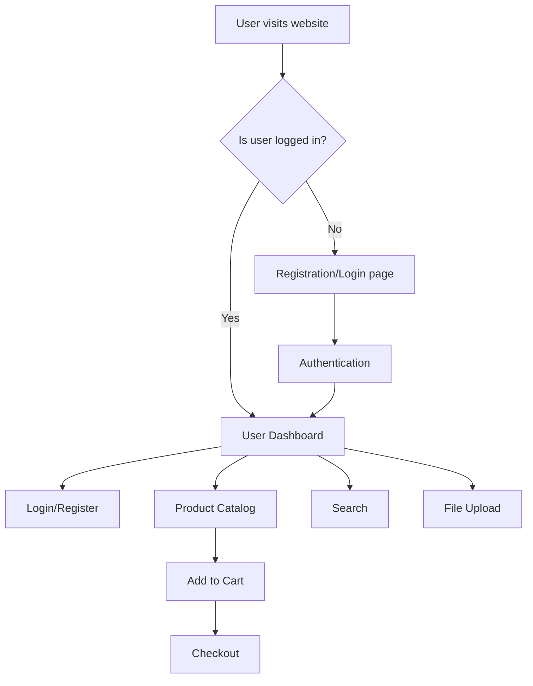
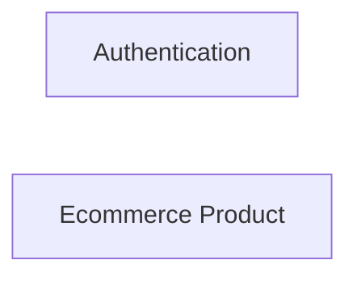
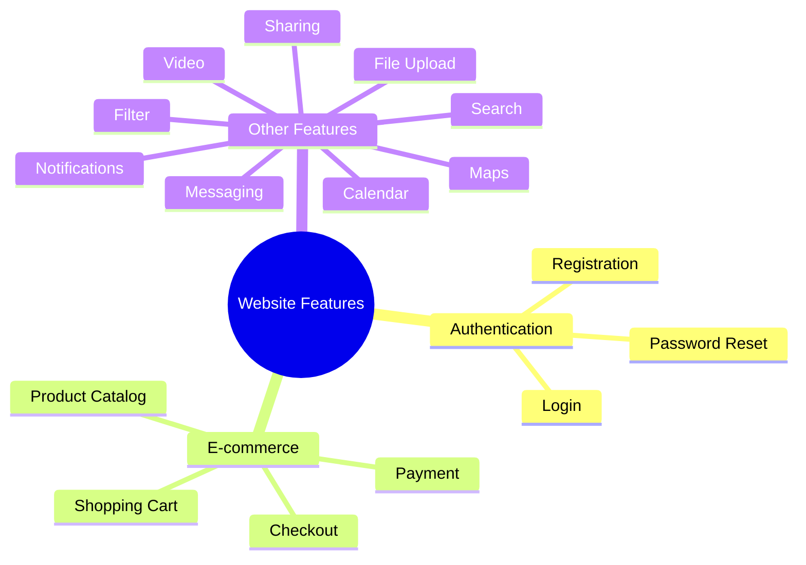

# All Diagrams for https://www.w3schools.com

*Generated on: 2025-09-20 23:45:04*

## User Flow Diagram

```mermaid
graph TD
    A[User visits website] --> B{Is user logged in?}
    B -->|No| C[Registration/Login page]
    B -->|Yes| D[User Dashboard]
    C --> E[Authentication]
    E --> D
    D --> I[Login/Register]
    D --> F[Product Catalog]
    F --> G[Add to Cart]
    G --> H[Checkout]
    D --> P[Search]
    D --> R[File Upload]
```

## Page Types Diagram

```mermaid
graph LR
    P1[Authentication]
    P2[Ecommerce Product]

```

## Feature Map Diagram

```mermaid
mindmap
  root((Website Features))
    Authentication
      Login
      Password Reset
      Registration
    E-commerce
      Checkout
      Payment
      Product Catalog
      Shopping Cart
    Other Features
      Calendar
      File Upload
      Filter
      Maps
      Messaging
      Notifications
      Search
      Sharing
      Video

```

